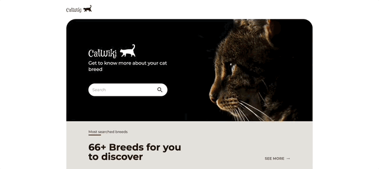

# Cat wiki 

Wiki with images and relevant information about your favorite cat breeds.

## Table of contents

* [General info](#general-info)
* [Technologies](#technologies)
* [Scope of functionalities](#scope-of-functionalities)
* [GIFS](#Gifs)
* [Launch](#launch)
* [Project status](#project-status)
* [Link to production site](https://unplash-meca.vercel.app/)

## General info

This is a fullstack site created to fulfill a challenge in the site: [devchallenges.io](https://devchallenges.io/)

## Technologies

* Next JS
* Tailwind
* Node JS
* GraphQL
* SQLite
* Git and Github

## Scope of functionalities

* You can see a summary of the most popular breeds on the site.
* You can search for your favorite cat breed and see information about it.
* You can go to the top 10 most popular breeds.
* You can click on the name of the most populars to see more information about it.

## Gifs
* Searching for breed


* Most popular breeds


* Breed details


## Launch

run yarn dev

## Project status

Version 1.0.1

```


